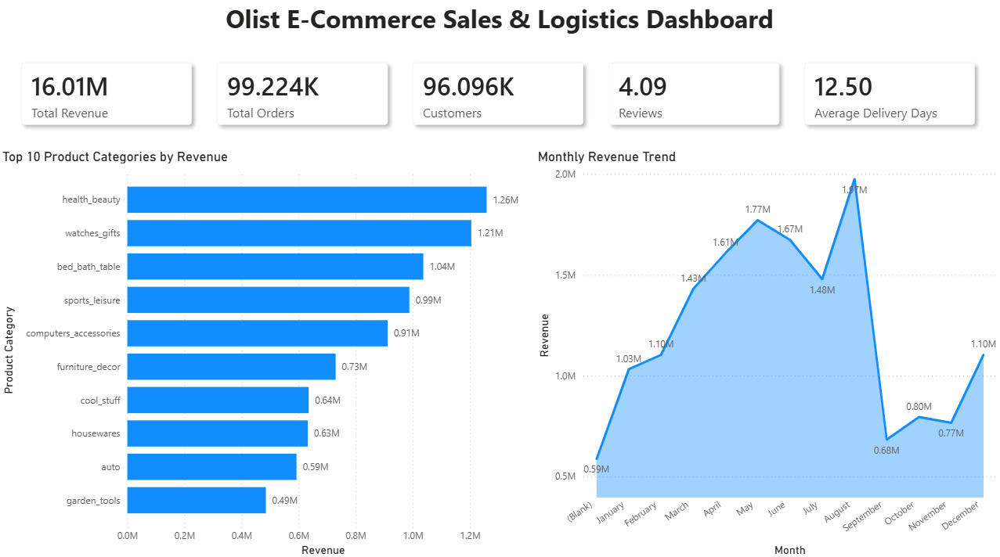
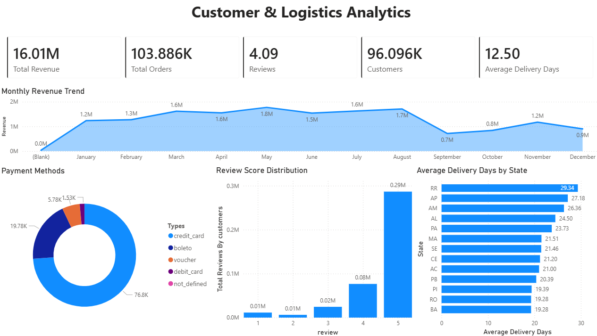

# Olist E-Commerce Analytics

An end-to-end e-commerce analytics project built using PostgreSQL and Power BI to analyze sales performance, customer behavior, logistics efficiency, and payment trends using the Brazilian Olist dataset.

---

# Project Overview

This project focuses on transforming raw e-commerce data into actionable business insights through SQL-based data analysis and interactive Power BI dashboards.

The project includes:

- Data cleaning and relational modeling in PostgreSQL
- SQL-based analytical queries
- KPI creation using DAX in Power BI
- Interactive dashboards for sales, customer, and logistics analysis

---

# Tools & Technologies

## Analytics & Visualization

- PostgreSQL
- Power BI
- DAX

## Development Environment

- VS Code

## Version Control & Project Hosting

- Git
- GitHub

---

# Key KPIs

- Total Revenue
- Total Orders
- Total Customers
- Average Review Score
- Average Delivery Days

---

# Dashboard Pages

## 1. Sales Overview

Includes:
- Monthly revenue trends
- Top product categories
- Payment method distribution
- Executive KPI summary



---

## 2. Customer & Logistics Analytics

Includes:
- Review score distribution
- Delivery performance by state
- Customer experience insights
- Operational KPI tracking



---

# SQL Files & Analysis

The project includes dedicated SQL scripts for database creation, validation, business analysis, and dashboard metrics.

## SQL Scripts

- `create_tables.sql` → Database schema creation and table setup
- `validation_queries.sql` → Data validation and integrity checks
- `analysis_queries.sql` → Core analytical SQL queries
- `business_queries.sql` → Business-focused KPI and performance analysis
- `dashboard_queries.sql` → Queries used for Power BI dashboard metrics

## Analysis Performed

The SQL analysis includes:

- Revenue and sales trend analysis
- Customer behavior analysis
- Delivery performance evaluation
- Product category revenue analysis
- Payment method distribution analysis
- Review score and customer satisfaction analysis
- State-wise operational performance analysis

---

# Data Modeling

Relational data modeling was implemented using PostgreSQL relationships between:
- customers
- orders
- products
- payments
- reviews
- order items

---

# Key Insights

- Most customers provide high review ratings, indicating generally positive customer satisfaction.
- Revenue is concentrated within a limited number of product categories.
- Certain states experience higher average delivery times, suggesting logistics inefficiencies.
- Credit cards dominate as the primary payment method.

---

# Project Structure

```text
olist-ecommerce-analytics/
│
├── data/
│   ├── olist_customers_dataset.csv
│   ├── olist_geolocation_dataset.csv
│   ├── olist_order_items_dataset.csv
│   ├── olist_order_payments_dataset.csv
│   ├── olist_order_reviews_dataset.csv
│   ├── olist_orders_dataset.csv
│   ├── olist_products_dataset.csv
│   ├── olist_sellers_dataset.csv
│   └── product_category_name_translation.csv
│
├── dashboard/
│   └── olist-ecommerce-analytics.pdf
│
├── dashboard-previews/
│   ├── sales_overview.png
│   └── customer_logistics.png
│
├── SQL Queries/
│   ├── analysis_queries.sql
│   ├── business_queries.sql
│   ├── create_tables.sql
│   ├── dashboard_queries.sql
│   └── validation_queries.sql
│
└── README.md
```

---

# Future Improvements

- Advanced customer segmentation
- Predictive analytics using Python
- Real-time dashboard integration
- Customer retention analysis

---

# Dataset

Brazilian E-Commerce Public Dataset by Olist.